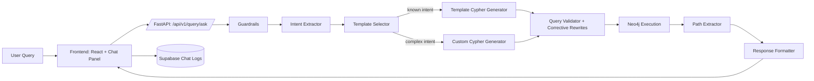

# Dodge Graph Query Assistant

Live Demo link: https://dodge-six-dusky.vercel.app/
Backend link: https://huggingface.co/spaces/parthnuwal7/dodge/tree/main?logs=container
Video link: https://youtu.be/Lt7ARqYgfI8

## What This Project Does
This project turns SAP Order-to-Cash data into a queryable graph and provides a chat-style interface to ask business questions in plain English.

In practice, it does three jobs well:
1. Build a graph model of the O2C process (Customer -> SalesOrder -> Delivery -> Invoice -> Payment).
2. Convert natural language into safe, schema-aware Cypher.
3. Return both tabular results and graph paths so answers are inspectable, not black-box.

Core stack:
- Backend: FastAPI, Neo4j, schema-guided LLM routing
- Frontend: React + Vite + Cytoscape
- Session persistence: Supabase (optional)

## Why This Design
Order-to-Cash is process data, not just records. Most high-value questions are multi-hop and relationship-heavy.

Examples:
- Which billed deliveries for customer X have no payment yet?
- Which plants are associated with delivered items in division 10?
- Which chains break between order and invoice?

These are awkward in relational query UIs but natural in a graph model. That is why Neo4j is central to the system, and why the query pipeline emphasizes path correctness.

## System Architecture

## Data Flow (Ingestion Side)
We treat ingestion as a schema-first process, not a blind import.

1. Load source entities from SAP O2C JSONL datasets.
2. Infer/curate graph schema (`nodes`, `edges`, ID fields, relationship joins).
3. Build normalized nodes and relationships in Neo4j.
4. Persist schema artifacts for runtime query validation and prompting.

Why this matters:
- The same schema powers ingestion, prompt constraints, and runtime query validation.
- This keeps generation and execution grounded to the actual graph shape.

## Query Flow (Runtime)
For `POST /api/v1/query/ask`, the backend pipeline is intentionally strict:

1. Input guardrail
2. Intent extraction
3. Domain/entity guardrail
4. Template route (deterministic) OR custom generation route
5. Cypher validation + corrective rewrite pass
6. Neo4j execution
7. Path extraction for graph highlighting
8. Response formatting (answer + explanation + cypher + rows + graph)

### Response Contract
Each answer returns:
- `answer` (human-readable)
- `explanation`
- `query_used` (final Cypher)
- `data` (tabular rows)
- `nodes`/`edges` (graph visualization payload)
- `metadata` (timing, intent, template, counts)

This is deliberate: users can verify what the system executed, not just trust the summary.

## Engineering Decisions and Tradeoffs

### 1) Neo4j as Source of Truth
We prioritized relationship traversal and path explainability over tabular convenience.

Benefits:
- Multi-hop traversal is concise and performant.
- Relationship direction is explicit (critical for process correctness).
- Native fit for path-based UI rendering.

Tradeoff:
- Requires strict schema/relationship governance to avoid drift.

### 2) Hybrid Query Strategy (Template-first)
We do not generate every query from scratch.

- Common intents use deterministic templates.
- Complex intents use custom LLM generation with schema and path constraints.

Why:
- Better reliability and lower variance for frequent asks.
- Flexibility when a query does not fit predefined intent classes.

### 3) FastAPI with Explicit Pipeline Boundaries
Services are split by responsibility (`query_router`, `query_validator`, `execution_engine`, `response_formatter`) so failures are stage-identifiable.

### 4) Explainability Over Minimal Payload
We intentionally return Cypher + path graph + table rows in one response to make debugging and trust easier in enterprise workflows.

## LLM Prompting Strategy
Prompting is schema-anchored and path-aware.

What we inject into prompts:
- Canonical node labels and properties
- Allowed relationship types and direction
- Candidate traversal skeletons from schema path search
- Identifier rules (primary keys, alternate IDs)
- Read-only constraints and output format requirements

This drastically reduces invalid relationship invention compared to unconstrained prompting.

## Guardrails and Validation
The system uses layered protection before query execution:

- Input guardrails: reject prompt-injection style patterns.
- Domain guardrails: check extracted entities against known graph schema.
- Output guardrails: enforce read-only query behavior.
- Schema validation: labels, relationships, directionality, malformed patterns.

Corrective rewrites are applied for common LLM mistakes (arrow syntax, invalid inline OR maps, EXISTS style fixes, path expressions in `WITH`).

When provider quotas are exhausted, the API surfaces a clear `429` (rate-limited) instead of opaque failures.

## Frontend Behavior
The UI has two modes:

1. Full Graph
2. Query Results (focused)

Query mode prioritizes relevant nodes/edges from returned paths and supports edge-focused highlighting from the side panel.

Chat behavior is session-based:
- Session ID is persisted client-side.
- History is restored from Supabase on reload.
- Quit clears session history and rotates to a new session.

## Deployment
Single repository, split deployment:

- Backend -> Hugging Face Space (Docker)
- Frontend -> Vercel (`frontend` root)

Frontend points to backend using `VITE_API_BASE_URL`.

## Repository Layout (Important Paths)
- `backend/app/api/` - HTTP routes
- `backend/app/services/` - orchestration services
- `backend/app/query/` - routing, validation, execution, formatting
- `backend/app/llm/` - intent extraction, prompt manager, template registry
- `backend/templates/cypher/` - deterministic Cypher templates
- `frontend/src/components/` - chat/graph panels
- `frontend/src/api/client.ts` - frontend API adapter

## Known Operational Constraints
- LLM providers can rate-limit (OpenRouter/Groq). Fallback is supported, but both can exhaust quota.
- Supabase chat logging requires service role key and existing `chat_logs` table.
- Neo4j schema quality directly affects custom-query reliability.

## Quick Start (Local)

Backend:
1. Set `backend/.env`
2. Run `uvicorn app.main:app --reload --port 8000`

Frontend:
1. Set `frontend/.env` if needed (`VITE_API_BASE_URL`)
2. Run `npm run dev` inside `frontend/`

Then open the frontend and start with any business question from the examples.
